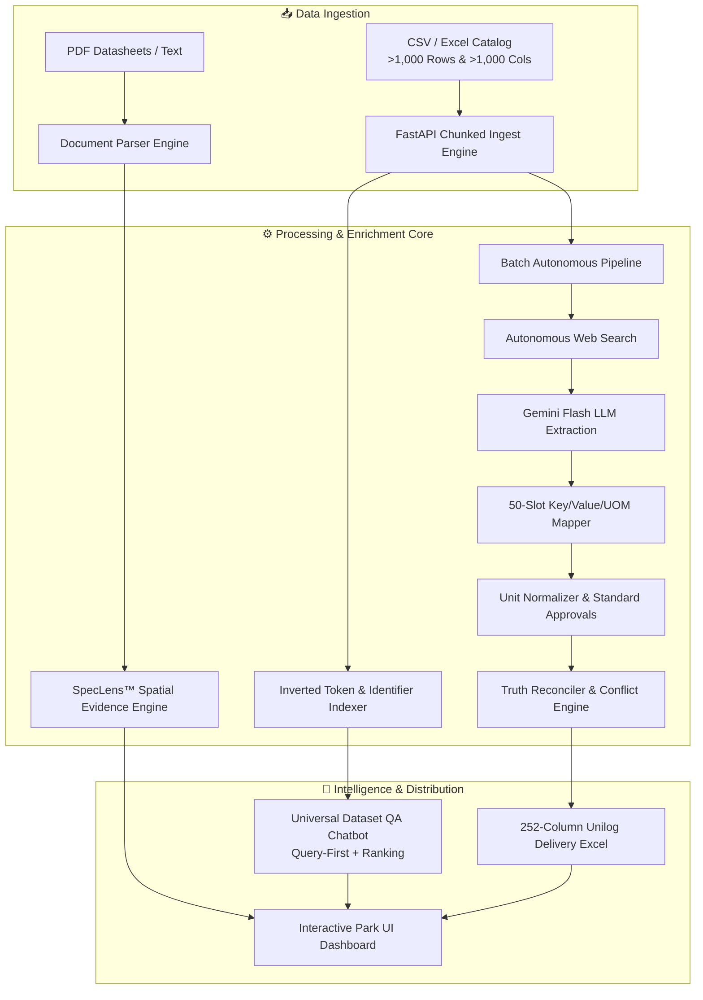

# ⚡ Parametric AI — Autonomous Industrial Product Intelligence Engine

[](https://fastapi.tiangolo.com)
[](https://react.dev)
[](https://vitejs.dev)
[](https://ai.google.dev)
[](https://python.org)

> **Autonomous industrial product data enrichment, visual spatial provenance, truth reconciliation, and zero-truncation dataset reasoning engine for modern industrial commerce.**

---

## 📌 Overview

Industrial product catalogs are plagued by fragmented attributes, missing technical specifications, inconsistent units of measure (UOM), and hallucinated e-commerce data. **Parametric AI** solves this through an end-to-end autonomous pipeline that extracts, standardizes, verifies, and reasons over technical product data at enterprise scale.

Whether processing a single complex industrial part or ingesting ultra-wide catalogs (**2,500+ rows** and **1,000+ columns**), Parametric AI guarantees **100% data preservation (0% row/column truncation)** and delivers deterministic, query-first accuracy with visual audit trails.

---

## 🚀 Key Features

### 1. 🔍 Autonomous Web Sourcing & Multi-Source Extraction
- **Zero-Input Sourcing**: Automatically queries OEM domains via DuckDuckGo search to locate official manufacturer datasheets, manuals, and technical tables.
- **Deep Document Ingestion**: Scrapes and parses high-density technical HTML, specification matrices, and multi-page engineering PDFs.

### 2. 🧠 Gemini Flash Parametric AI Extraction
- **50-Slot Attribute Extraction**: Parses dense engineering text into structured `(Key, Value, UOM)` triplets.
- **252-Column Unilog Master Delivery Schema**: Formats raw specs into standard 252-column industrial commerce distribution sheets.
- **Hierarchical Taxonomy Classification**: Maps products into structured Department (`dept`), Class (`class`), and Fine-grained classification paths.

### 3. 🔬 SpecLens™ Visual Spatial Provenance
- **Audit-Ready Evidence**: Pinpoints the exact bounding-box coordinates $(x_0, y_0, x_1, y_1)$ on original manufacturer PDF datasheets for every extracted attribute.
- **Human-in-the-Loop Validation**: Allows engineers and catalog managers to inspect source evidence and override values in real time.

### 4. ⚖️ Truth Reconciliation & Conflict Resolution
- **Multi-Source Conflict Detection**: Automatically flags discrepancies when manufacturer datasheets and distributor catalogs provide conflicting electrical, mechanical, or thermal ratings.
- **Deterministic Priority Rules**: Resolves conflicting values using source authority hierarchies and confidence scoring.

### 5. 📏 Industrial Unit Normalization
- Converts arbitrary regional engineering units into standardized SI / Imperial equivalents (e.g., `PSI` ↔ `bar`, `HP` ↔ `kW`, `mm` ↔ `in`, `V`, `A`, `RPM`, `N·m`).
- Standardizes international regulatory and compliance standards (`UL`, `CSA`, `CE`, `NEMA`, `ANSI`, `RoHS`).

### 6. ⚡ Scalable Inverted Index & Dataset QA Engine
- **Ultra-Wide & Deep Datasets**: Ingests and indexes massive datasets exceeding **2,500+ rows** and **1,000+ columns** with strict assertion checks:
  $$\text{TOTAL CSV ROWS} == \text{TOTAL INDEXED ROWS}$$
  $$\text{TOTAL CSV COLUMNS} == \text{TOTAL INDEXED COLUMNS}$$
- **Query-First Retrieval**: Prevents generic catalog overviews when querying specific SKUs, models, or part numbers.
- **Full-Catalog Ranking**: Answers superlative queries (*"Which product has the highest pressure?"*) by evaluating across all rows and columns in sub-millisecond memory lookups.
- **Zero Hallucination Guarantee**: Returns explicit *not found* acknowledgments when items or specifications do not exist in the dataset.

---

## 🏗️ System Architecture



---

## 💻 Tech Stack

- **Backend**: Python 3.10+, FastAPI, Uvicorn, Pandas, OpenPyXL, Pydantic, Requests, BeautifulSoup4
- **AI & Reasoning**: Google Gemini Flash (`gemini-2.0-flash` / `gemini-1.5-flash`), Custom Token Inverted Indexer
- **Frontend**: React 19, Vite 8, Lucide Icons, Canvas Confetti, Park UI Modern Dark-Mode Design System
- **Testing**: FastAPI TestClient, Starlette, Pytest

---

## 📂 Project Structure

```bash
parametric-ai/
├── backend/
│   ├── main.py                   # FastAPI service & API endpoints
│   ├── dataset_indexer.py        # Scalable inverted index engine (1,000+ rows/cols)
│   ├── gemini_engine.py          # Gemini Flash AI reasoning & query-first chatbot
│   ├── pipeline.py               # Autonomous batch catalog enrichment pipeline
│   ├── unit_normalizer.py        # Industrial engineering unit conversion engine
│   ├── truth_reconciler.py       # Multi-source conflict detection & resolution
│   ├── knowledge_graph.py        # Product relationship & taxonomy graph
│   ├── pdf_parser.py             # Spatial PDF bounding-box extractor
│   └── dataset.py                # Built-in industrial product catalog
├── src/
│   ├── components/
│   │   ├── BatchProcessor.jsx    # Evaluator batch CSV/Excel processing UI
│   │   ├── SpecLensViewer.jsx    # Visual spatial PDF bounding-box evidence viewer
│   │   ├── AIChatBot.jsx         # Contextual & dataset-wide conversational QA
│   │   ├── ProductCatalog.jsx    # Interactive parametric catalog view
│   │   └── AttributeTable.jsx    # Reconciled attribute table with edit overrides
│   ├── App.jsx                   # Main application orchestrator
│   └── index.css                 # Park UI design tokens and micro-animations
├── test_large_dataset_qa.py      # QA test suite for 2,500+ row datasets
├── test_large_columns_dataset_qa.py # QA test suite for 1,050+ column datasets
├── test_chat_dataset.py          # Backend dataset chat & retrieval tests
├── dry_run_test.py               # Full catalog pipeline dry-run validator
├── package.json                  # Node.js dependencies (Vite + React)
└── requirements.txt              # Python dependencies
```

---

## ⚡ Getting Started

### Prerequisites
- **Python 3.10+** installed
- **Node.js 18+** & `npm` installed
- *(Optional)* Google Gemini API Key (a deterministic zero-cost index engine runs natively without an API key)

### 1. Clone Repository & Install Dependencies

```bash
# Clone the repository
git clone https://github.com/your-username/parametric-ai.git
cd parametric-ai

# Install Python backend requirements
pip install -r requirements.txt

# Install Frontend dependencies
npm install
```

### 2. Configure Environment (Optional)

```bash
# Set Gemini API Key (optional for live LLM reasoning)
export GEMINI_API_KEY="your-gemini-api-key-here"
```

### 3. Run the Development Servers

**Start Backend (FastAPI):**
```bash
python -m uvicorn backend.main:app --host 0.0.0.0 --port 8000 --reload
```

**Start Frontend (Vite + React):**
```bash
npm run dev
```
Deployment Phase
*****yet to deploye


---

## 🧪 Testing & Validation Suites

Parametric AI includes automated verification suites covering large-scale ingestion, zero-truncation assertions, and query-first retrieval:

```bash
# 1. Test 1,000+ Row Dataset Ingestion & QA (2,500 data rows)
python test_large_dataset_qa.py

# 2. Test 1,000+ Column Wide Dataset Ingestion & QA (1,050 columns)
python test_large_columns_dataset_qa.py

# 3. Test Dataset Chat & Query-First Retrieval
python test_chat_dataset.py

# 4. Dry Run Full Catalog Pipeline
python dry_run_test.py
```

---

## 📡 Key API Endpoints

| Method | Endpoint | Description |
| :--- | :--- | :--- |
| `GET` | `/` | Service health and active product counts |
| `GET` | `/api/products` | Retrieve all active catalog products |
| `POST` | `/api/analyze` | Perform unit normalization, truth reconciliation & SpecLens extraction |
| `POST` | `/api/upload_dataset` | Ingest arbitrary CSV/Excel datasets without row or column limits |
| `POST` | `/api/chat_dataset` | Dataset-wide query-first QA across all indexed rows and columns |
| `POST` | `/api/process_evaluator_dataset` | Evaluator batch pipeline generating 252-column Unilog Excel deliverable |
| `POST` | `/api/update_attribute` | Human-in-the-loop attribute modification and audit update |

---

